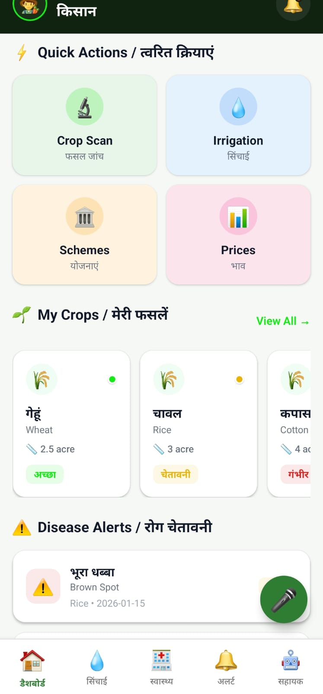

# 🌾 SmartKisan - AI-Powered Agricultural Assistant

> **Empowering Indian Farmers with Voice-Enabled Smart Agriculture Solutions**

[](https://reactnative.dev/)
[](https://expo.dev/)
[](https://www.typescriptlang.org/)
[](LICENSE)

---

## 📱 Overview

**SmartKisan** is a mobile-first agricultural application designed specifically for Indian farmers. It leverages voice commands in Hindi/Hinglish, real-time market data, and AI-powered recommendations to help farmers make informed decisions about crop management, irrigation, disease detection, and government schemes.

The app bridges the digital divide by making advanced agricultural technology accessible to farmers with limited technical expertise through intuitive voice interfaces and bilingual support.

---

## ✨ Key Features

### 🎤 **Voice Command Assistant**
- **Hindi/Hinglish Support** - Speak commands in your native language
- **Natural Language Processing** - Understands farmer terminology and context
- **Smart Intent Recognition** - Maps voice commands to relevant actions
- **Text-to-Speech Responses** - Receives answers in Hindi or English
- **Global Floating Button** - Access voice commands from any screen

**Example Commands:**
```
"योजना दिखाओ" (Show schemes)
"गेहूं का भाव बताओ" (Show wheat prices)
"सिंचाई की सलाह दो" (Give irrigation advice)
"rog dikhao" (Show diseases)
```

### 📊 **Market Price Tracking (Mandi Bhav)**
- **Real-time Crop Prices** - Live prices across multiple mandis (markets)
- **Price Trends** - Visual indicators for price movements (↑ ↓ →)
- **Best Mandi Recommendation** - Suggests the market with highest returns
- **Supported Crops** - Wheat, Rice, Cotton, Onion, Tomato, Sugarcane
- **Offline Support** - Works without internet using cached data

### 🏛️ **Government Schemes Navigator**
- **Comprehensive Scheme Database** - 50+ active government schemes
- **Smart Eligibility Checker** - Automatically determines if farmer qualifies
- **Document Requirements** - Shows exactly what documents are needed
- **Direct Application Links** - One-tap access to apply online
- **Bilingual Descriptions** - Hindi & English scheme details

**Eligibility Factors:**
- Land size validation
- State-specific requirements
- Aadhaar & Bank account requirements
- Category-based eligibility

### 🌾 **Crop Health Management**
- **Health Status Tracking** - Good / Warning / Critical indicators
- **Disease Detection** - Scan crops for common diseases
- **Treatment Recommendations** - Actionable disease mitigation strategies
- **Health Timeline** - Historical records of crop conditions
- **Priority Alert System** - Know which crops need immediate attention

### 💧 **Smart Irrigation System**
- **Water Requirement Calculator** - Calculates optimal watering schedule
- **Water Savings Analysis** - Shows % water saved vs standard practices
- **Soil Moisture Tracking** - Real-time moisture level monitoring
- **Crop-Specific Advice** - Different recommendations for different crops
- **Cost-Benefit Analysis** - Calculate water bill savings

### ⚠️ **Real-time Alert System**
- **Disease Alerts** - Notified of potential crop diseases
- **Weather Warnings** - Severe weather notifications
- **Market Alerts** - Price spike notifications
- **Task Reminders** - Irrigation, fertilizer, harvest reminders

### 👨‍🌾 **Farmer Dashboard**
- **At-a-Glance Overview** - All important metrics in one view
- **Priority Task List** - Sorted by urgency
- **Crop Cards** - Quick status of each crop
- **Recent Diseases** - Recent disease occurrences
- **Quick Navigation** - Fast access to all features

---

## 🛠️ Tech Stack

| Category | Technology |
|----------|-----------|
| **Frontend** | React Native 0.72.6 |
| **Framework** | Expo 49.0.0 |
| **Language** | TypeScript |
| **Navigation** | React Navigation v6 |
| **State Management** | React Hooks |
| **Voice** | expo-speech, expo-av |
| **Storage** | AsyncStorage |
| **Localization** | i18n-js |
| **Styling** | React Native StyleSheet |

---

## 📦 Installation & Setup

### Prerequisites
- **Node.js** 16+ and **npm** 8+
- **Expo CLI** or **Expo Go** app on your phone
- Basic knowledge of React Native

### Step 1: Clone Repository
```bash
git clone https://github.com/yourusername/SmartKisan.git
cd SmartKisan
```

### Step 2: Install Dependencies
```bash
npm install
# or
yarn install
```

### Step 3: Start Development Server
```bash
npm start
# or
expo start
```

### Step 4: Run on Device
**Option A - Using Expo Go (Recommended for Testing)**
1. Download [Expo Go](https://expo.dev/client) from App Store or Play Store
2. Scan the QR code shown in terminal with your phone
3. App loads instantly on your device

**Option B - Android Emulator**
```bash
npm run android
```

**Option C - iOS Simulator (macOS only)**
```bash
npm run ios
```

---

## 📁 Project Structure

```
SmartKisan/
├── App.tsx                          # Root component with navigation setup
├── package.json                     # Dependencies & scripts
├── tsconfig.json                    # TypeScript configuration
├── babel.config.js                  # Babel configuration
├── app.json                         # Expo app configuration
│
├── src/
│   ├── components/                  # Reusable UI components
│   │   ├── FloatingMicButton.tsx    # Global voice button
│   │   ├── VoiceModal.tsx           # Voice recording/processing modal
│   │   └── index.ts
│   │
│   ├── screens/                     # App screens/pages
│   │   ├── DashboardScreen.tsx      # Main dashboard
│   │   ├── CropDetailsScreen.tsx    # Individual crop details
│   │   ├── CropHealthDetailScreen.tsx
│   │   ├── DiseaseScanScreen.tsx    # Disease detection
│   │   ├── DiseaseResultScreen.tsx
│   │   ├── DiseaseDetailsScreen.tsx
│   │   ├── IrrigationScreen.tsx     # Irrigation info
│   │   ├── IrrigationRecommendationScreen.tsx
│   │   ├── MarketPricesScreen.tsx   # Mandi bhav
│   │   ├── GovernmentSchemesScreen.tsx
│   │   ├── SchemeDetailScreen.tsx
│   │   ├── AlertsScreen.tsx         # Notifications
│   │   ├── HealthHomeScreen.tsx     # Crop health hub
│   │   ├── AssistantScreen.tsx      # AI assistant
│   │   └── index.ts
│   │
│   ├── services/                    # Business logic & API
│   │   ├── intentRouter.ts          # Voice command processing
│   │   ├── voiceService.ts          # Text-to-speech & speech recognition
│   │   ├── mandiService.ts          # Market prices logic
│   │   ├── schemeService.ts         # Government schemes logic
│   │   ├── apiService.ts            # API integration points
│   │   └── Additional services...
│   │
│   ├── data/                        # Mock data & JSON files
│   │   ├── mockData.ts              # Crop & farm data
│   │   ├── mandi_prices.json        # Market prices database
│   │   ├── schemes.json             # Government schemes database
│   │   ├── farmerProfile.json       # Sample farmer profile
│   │   └── Other data files...
│   │
│   ├── navigation/                  # Navigation setup
│   │   ├── AppNavigator.tsx         # Navigation structure
│   │   └── Navigation types...
│   │
│   ├── i18n/                        # Internationalization
│   │   └── translations.ts          # Hindi & English strings
│   │
│   └── types/                       # TypeScript interfaces
│       └── index.ts                 # Shared types & interfaces
│
├── assets/                          # Screenshots & media
│   ├── screenshots/
│   ├── icons/
│   └── Other assets...
│
└── README.md                        # This file
```

---

## 🎙️ Voice Command System

### How It Works

```
User Voice Input
       ↓
Audio Recording (expo-av)
       ↓
Speech Recognition
       ↓
Intent Router Analysis
       ↓
Intent Matching with Confidence Score
       ↓
Action Execution / Navigation
       ↓
Text-to-Speech Response (expo-speech)
```

### Supported Intents

| Intent | Commands | Action |
|--------|----------|--------|
| **SHOW_SCHEMES** | scheme, yojana, government | Navigate to Schemes screen |
| **SHOW_PRICES** | bhav, mandi, price, rate | Navigate to Market Prices |
| **CROP_PRICE** | [crop] ka bhav | Show specific crop price |
| **SHOW_IRRIGATION** | sinchai, irrigation, water | Navigate to Irrigation |
| **SHOW_HEALTH** | health, disease, rog | Navigate to Health screen |
| **SHOW_DASHBOARD** | home, dashboard | Return to Dashboard |
| **SHOW_ALERTS** | alert, notification | Navigate to Alerts |
| **CHECK_ELIGIBILITY** | eligible, scheme ke liye | Check scheme eligibility |

### Intent Recognition Logic

```typescript
// 1. Normalize input (lowercase, remove accents)
const normalized = normalizeText(userInput);

// 2. Check against intent patterns
for (const [intent, patterns] of Object.entries(intentPatterns)) {
  if (patterns.some(p => normalized.includes(p))) {
    // Match found
  }
}

// 3. Extract parameters (crop names, etc.)
const params = extractParameters(intent, normalized);

// 4. Calculate confidence score
const confidence = calculateConfidence(match, normalized);

// 5. Execute action with parameters
executeIntent(intent, params);
```

---

## 📊 Market Prices (Mandi Bhav)

### Data Structure
```typescript
{
  "prices": [
    {
      "crop": "Wheat",
      "cropHindi": "गेहूं",
      "mandis": [
        {
          "name": "Jalandhar Mandi",
          "price": 2200,
          "trend": "up",
          "change": 2.5
        },
        {
          "name": "Chandigarh Mandi",
          "price": 2150,
          "trend": "stable",
          "change": 0
        }
      ]
    }
  ]
}
```

### Features
- **Caching** - Data cached locally with AsyncStorage for offline access
- **Best Mandi Selection** - Algorithm finds highest price for maximum farmer income
- **Trend Analysis** - Shows price movement direction
- **Refresh Logic** - Fetches latest data when online, uses cache when offline

---

## 🏛️ Government Schemes

### Eligibility Checking Algorithm

```
For each scheme:
  1. Check land size → Within limits?
  2. Check state → Available in farmer's state?
  3. Check category → Farmer qualifies by category?
  4. Check documents → Has Aadhaar? Bank account?
  5. Check other criteria
  
  Result:
    ✅ All criteria met → ELIGIBLE
    ❌ Missing requirements → NOT ELIGIBLE (show missing items)
    ⚠️ Some criteria met → PARTIALLY ELIGIBLE (show progress)
```

### Scheme Categories
- **PM Kisan** - Direct income support
- **Crop Insurance** - Pradhan Mantri Fasal Bima Yojana
- **Irrigation** - Pradhan Mantri Krishi Sinchayee Yojana
- **Fertilizer Subsidy** - Soil health & nutrients
- **Seed Programs** - Quality seed distribution
- **Training Programs** - Skill development

---

## 💧 Irrigation Recommendations

### Water Calculation Formula
```
Recommended Water = 
  Base Amount × (Soil Moisture Factor) × (Crop Type Factor) × (Season Factor)

Water Savings % = 
  (Standard Water - Recommended Water) / Standard Water × 100

Cost Saved = Water Savings % × Water Bill Rate
```

### Crop-Specific Multipliers
```
Wheat: 0.8x (Lower water requirement)
Rice: 1.5x (Higher water requirement)
Cotton: 1.2x (Moderate-high water requirement)
Sugarcane: 1.4x (High water requirement)
```

---

## 🌾 Crop Health System

### Health Status Levels

| Status | Color | Meaning | Action |
|--------|-------|---------|--------|
| **Good** | 🟢 Green | Crop thriving | Continue current care |
| **Warning** | 🟡 Orange | Minor issues | Increase monitoring |
| **Critical** | 🔴 Red | Serious problems | Immediate intervention needed |

### Disease Detection Workflow
1. **Scan** - Take photo of affected crop area
2. **Analyze** - AI identifies potential diseases
3. **Diagnose** - Confirms disease with confidence score
4. **Recommend** - Provides treatment options
5. **Track** - Monitors recovery progress

---

## 🚀 Usage Examples

### Example 1: Check Government Schemes
```
User: "क्या मैं सरकारी योजना के लिए पात्र हूं?"
App: Records voice → Detects intent "CHECK_ELIGIBILITY"
    → Loads farmer profile → Checks all schemes
    → Displays eligible schemes with benefits
```

### Example 2: Get Market Price Advice
```
User: "गेहूं का भाव क्या है?"
App: Records voice → Detects "CROP_PRICE" intent
    → Extracts crop "Wheat" → Fetches mandi prices
    → Speaks: "गेहूं की सर्वोत्तम कीमत जालंधर मंडी में ₹2,200 है"
    → Shows all mandis with prices
```

### Example 3: Get Irrigation Advice
```
User: "मेरी गेहूं को कितना पानी चाहिए?"
App: Records voice → Detects "SHOW_IRRIGATION" intent
    → Gets current crop data → Calculates water needs
    → Shows: "मिट्टी की नमी देखते हुए 5,000 लीटर पानी दें"
    → Highlights water savings (30% vs standard)
```

---

## 🔐 Data & Privacy

- **Local Storage** - All farmer data stored locally on device
- **AsyncStorage** - Secure encrypted storage via AsyncStorage
- **No Cloud Sync** - Data doesn't leave device unless explicitly shared
- **Optional Profile** - Farmer can choose what to store
- **Offline First** - Fully functional without internet

---

## 🐛 Common Issues & Solutions

### Issue: "expo is not recognized"
```bash
# Solution: Use npx to run expo
npx expo start
```

### Issue: Voice commands not working
- ✅ Check microphone permissions in app settings
- ✅ Speak clearly in Hindi/Hinglish
- ✅ Ensure phone has working microphone

### Issue: Prices not loading
- ✅ Check internet connection (or use cached data)
- ✅ Verify mandi_prices.json exists
- ✅ Check AsyncStorage has space

### Issue: App crashing on launch
- ✅ Clear AsyncStorage: Delete app & reinstall
- ✅ Check TypeScript compilation errors
- ✅ Review device logs for detailed errors

---

## 🚧 Development Roadmap

### Phase 1: Core Features ✅
- [x] Voice command system
- [x] Market price tracking
- [x] Government schemes
- [x] Crop health basics

### Phase 2: AI Integration 🚀
- [ ] Real crop disease detection (ML model integration)
- [ ] Weather API integration
- [ ] Predictive yield analysis
- [ ] Soil quality analysis

### Phase 3: Advanced Features
- [ ] Community marketplace (farmer-to-farmer selling)
- [ ] Expert consultation booking
- [ ] Real-time weather alerts
- [ ] Supplier recommendations
- [ ] Loan processing assistance

### Phase 4: Backend & Scalability
- [ ] REST API backend
- [ ] Real-time database (Firebase)
- [ ] Push notifications
- [ ] Analytics dashboard
- [ ] Admin panel

---

## 🤝 Contributing

We welcome contributions! Here's how to help:

### 1. Fork the Repository
```bash
git clone https://github.com/yourusername/SmartKisan.git
```

### 2. Create Feature Branch
```bash
git checkout -b feature/amazing-feature
```

### 3. Make Changes
```bash
# Edit files, add features
```

### 4. Commit Changes
```bash
git commit -m 'Add amazing feature'
```

### 5. Push to Branch
```bash
git push origin feature/amazing-feature
```

### 6. Open Pull Request
- Describe your changes clearly
- Include before/after screenshots
- Link any related issues

---

## 📜 License

This project is licensed under the **MIT License** - see [LICENSE](LICENSE) file for details.

---

## 📧 Contact & Support

- **Issues & Bugs**: [GitHub Issues](https://github.com/yourusername/SmartKisan/issues)
- **Questions**: [GitHub Discussions](https://github.com/yourusername/SmartKisan/discussions)
- **Email**: support@smartkisan.app

---

## 🙏 Acknowledgments

- **React Native Team** - For the amazing framework
- **Expo** - For simplifying mobile development
- **Indian Government** - For open scheme data
- **Farming Community** - For feedback and testing

---

## 📸 Screenshots & UI Showcase

All screenshots and UI mockups are available in the [assets](assets/) directory. Here's a comprehensive visual tour:

### 🔧 **1. IoT Hardware Integration**

- Real sensor integration with breadboards
- Arduino/Microcontroller setup for soil moisture, temperature monitoring
- Direct integration with SmartKisan app for real-time data
- Multi-sensor node configuration for comprehensive farm monitoring

### 📊 **2. Dashboard Overview**

- Comprehensive farm overview at a glance
- Crop status cards with health indicators
- Priority tasks sorted by urgency
- Quick action buttons for main features
- Bilingual Hindi/English interface
- Real-time alerts and notifications

### 🎯 **3. Dashboard (Detailed View 2)**

- My Crops section with individual crop cards
- Crop status badges (Good/Warning/Critical)
- Land area details (in acres)
- Disease alerts with timestamps
- Smooth navigation and filtering options
- Quick access to crop details

### 💧 **4. Irrigation Recommendations**

- Smart Irrigation statistics (148K liters, 20% water saved)
- Soil type selection (Loamy, Sandy, Clay)
- AI-powered recommendation button
- Today's watering schedule
- Per-crop water requirements:
  - Rice: 5000L with 15% water savings
  - Cotton: 3000L with 20% water savings
  - Wheat: 3000L (partially visible)
- Water-saving tips and benefits highlighted
- Crop-specific irrigation advice in Hindi

### 🏥 **5. Crop Health Monitor**

- Health Monitor dashboard (फसल स्वास्थ्य निगरानी)
- Health status overview: 2 Healthy, 1 Warning, 1 Critical
- Your Crops section with 4 crops tracked
- Individual crop cards showing:
  - Crop type (Wheat/Rice/Cotton)
  - Health status with color indicators
  - Field location
  - Disease records
- Quick action buttons:
  - Scan Disease (फसल जांच)
  - Health Report (स्वास्थ्य रिपोर्ट)
- Global microphone button for voice commands

### 🚨 **6. Alerts & Notifications**

- **Severe Alerts** (गंभीर अलर्ट) - Red notifications
  - Cotton disease alert with action prompt
  
- **Warnings** (चेतावनी) - Orange notifications
  - Rice attention needed for extra care
  
- **Disease Alerts** (रोग अलर्ट) - Purple badge
  - Brown Spot in Rice (Status: Moderate)
  - Bollworm in Cotton (Status: High)
  
- **Weather Alerts** (मौसम अलर्ट)
  - Clear weather today
  
- Organized by alert type and severity
- Action links on each alert
- Timestamp for each notification
- Alert count indicators (1, 2, etc.)

### 🎤 **7. Voice Assistant Modal**

- **बोलकर पूछो** (Ask by Speaking) interface
- Large microphone button (green circle) for voice input
- "माइक दबाकर बोलें" (Press mic and speak) instruction
- Status: "या नीचे से चुनें" (Or choose from below)
- **Quick Commands** buttons:
  - फसल स्कैन (Crop Scan)
  - बीमारी बताओ (Tell Disease)
  - सिंचाई (Irrigation)
  - मौसम (Weather)
  - मंडी भाव (Market Price)
  - योजनाएं (Schemes)
- Text option: "टाइप करके पूछें" (Ask by typing)
- Floating microphone button for easy access
- Dark theme for night usage

### 💬 **8. AI Chatbot Assistant**

- **AI Assistant** with online status indicator (🟢 Online)
- Quick question suggestions at top:
  - "गेहूं में पानी?" (Water for Wheat?)
  - "रोग पहचान" (Disease Detection)
  - "खाद कब दें?" (When to apply fertilizer?)
  - "सिंचाई की सलाह" (Irrigation advice)
- **Assistant Response** (in Hindi):
  - "नमस्ते! मैं आपका कृषि सहायक हूँ। आप मुझसे फसलों, सिंचाई, खाद या किसी भी कृषि समस्या के बारे में पूछ सकते हैं।"
  - Translation: "Hello! I'm your agricultural assistant. You can ask me about crops, irrigation, fertilizer, or any farming problem."
- Timestamp of conversation (1:07 pm)
- Audio playback option for responses
- Bottom input: "अपना सवाल पूछें" (Ask your question)
- Floating microphone for voice input
- Chat history with clear conversation flow

---

## 📁 Assets Directory Structure

```
assets/
├── 1_iot_hardware.jpeg              # Hardware sensor setup
├── 2_dashboard.jpeg                 # Main dashboard overview
├── 3_dashboard_2.jpeg               # Dashboard detailed view
├── 4_irrigation.jpeg                # Irrigation recommendations
├── 5_health_monitor.jpeg            # Crop health monitoring
├── 6_alerts.jpeg                    # Alerts & notifications
├── 7_voice_assistant.jpeg           # Voice command interface
├── 8_ai_chatbot.jpeg                # AI chatbot assistant
└── Other assets...
```

---

## 🌟 Show Your Support

If SmartKisan helped you or your farming friends, please:
- ⭐ Give this repo a star
- 📢 Share with other farmers
- 💬 Leave feedback and suggestions
- 🐛 Report bugs you find

---

**Made with ❤️ for Indian Farmers | Helping Agriculture Go Digital**

*SmartKisan - Your Digital Agricultural Assistant*

